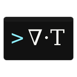
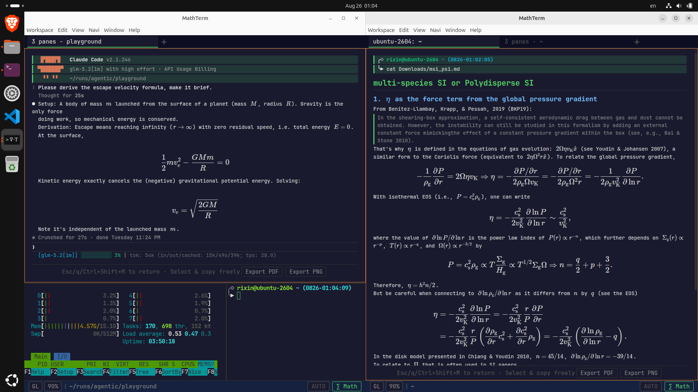

<div align="center">



# MathTerm

An Electron terminal with browser-style tabs, split panes, and a math-aware view for LaTeX and Markdown output.

</div>

## Screenshot

<div align="center">
  
</div>

## Features

- A full PTY-backed terminal powered by xterm.js, with WebGL rendering and a DOM fallback.
- Browser-style tabs that can be reordered, moved between MathTerm windows, or detached into new windows without restarting their PTYs.
- Split panes with directional focus, resizing, maximization, and per-pane zoom.
- Manual and automatic math views for LaTeX, Markdown, tables, fenced code, ANSI colors, and inline images.
- Math-aware search, prompt navigation, PDF export, and PNG export.
- Configurable themes, fonts, shortcuts, persistent LaTeX macros, and terminal behavior.
- Optional multi-window session restore with fresh shells in the saved local directories.
- Linux and Windows release builds for x64, plus Linux ARM64 builds.

MathTerm is still pre-1.0 software. The terminal and session paths are in regular use, but release builds should still be treated as preview releases.

## Using Math Mode

Math mode renders LaTeX, Markdown, tables, code blocks, ANSI colors, and inline images from the active terminal pane. Toggle it by clicking the **Math** button in the status bar or with:

- macOS: `Cmd+Shift+M`
- Linux and Windows: `Ctrl+Shift+M`

Use the same button or shortcut to return to the normal terminal view.

## Installation

Download release files from the [latest GitHub release](https://github.com/astroboylrx/mathterm/releases/latest).

### Linux

Release builds are produced for x64 and ARM64. They are built in an Ubuntu 20.04 userspace to retain glibc compatibility with Ubuntu 20.04 and newer releases; each target release is still checked independently before it is described as supported.

Install the Debian package:

```bash
sudo apt install ./MathTerm-0.11.0-arm64.deb
```

Use the `x64` file instead on an Intel/AMD machine. To run the AppImage without installing it:

```bash
chmod +x MathTerm-0.11.0-arm64.AppImage
./MathTerm-0.11.0-arm64.AppImage
```

### Windows

Download the x64 installer (`.exe`) or portable archive (`.zip`) from the latest release. The Windows build is not code-signed, so Windows SmartScreen may display an unknown-publisher warning.

### macOS (Build from Source)

MathTerm does not distribute a signed macOS package. Building locally avoids distributing an unsigned downloaded app and only takes a few commands.

**1. Install the build dependencies**

Install the Xcode command-line tools and Node.js:

```bash
xcode-select --install
brew install node
```

If `xcode-select` reports that the tools are already installed, continue to the next step.

**2. Download the source code**

```bash
git clone https://github.com/astroboylrx/mathterm.git
cd mathterm
```

To build a specific release instead of the current development branch, run `git checkout v0.11.0` after cloning.

**3. Install dependencies and build the app**

```bash
npm ci
npm run dist:mac:dir
```

**4. Install and launch MathTerm**

```bash
APP_PATH="$(find dist-electron -maxdepth 2 -name MathTerm.app -print -quit)"
cp -R "$APP_PATH" /Applications/
open /Applications/MathTerm.app
```

Because the app was built locally, no Apple Developer certificate is required. Rebuild after pulling a new version.


## Command Line

Linux package installations provide the `mathterm` launcher:

```text
Usage: mathterm [options]

Options:
  --session <file>  Load a session JSON file and restore it on startup
  -h, --help        Show this help
```

From a source checkout, use `node bin/mathterm.js` in place of `mathterm`.

## Configuration

Preferences are available from the application menu. On Mac or Linux, MathTerm stores its configuration under `~/.config/mathterm/`:

- `mathterm.json` contains preferences and shortcut bindings.
- `session.json` contains optional session-restore state.
- `themes/` contains user-defined themes.
- `logs/diagnostics.log` is created when renderer diagnostics need to be recorded.
